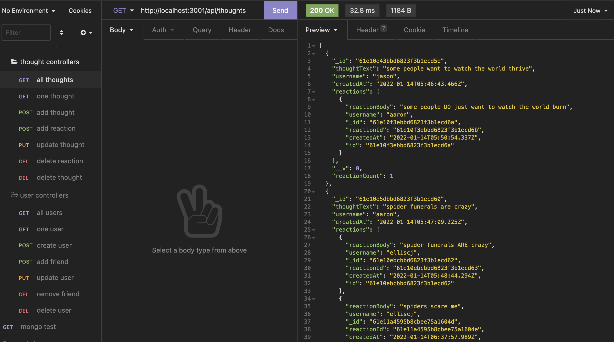

# Social Network API

## Description

When you are building a social network, the most important thing is data storage and data relationships. This api demonstrates how simple and effective MongoDB can be at managing that need.

## Table of Contents

- [Installation](#installation)
- [Usage](#usage)
- [Tests](#tests)
- [Contributing](#contributing)
- [License](#license)
- [Link](#link)
- [Screenshot](#screenshot)
- [Questions](#questions)

## Installation

    npm i

## Usage

Once you have cloned the repo to your local machine, simply run `node server.js` to start the server and begin using the API.

## Tests

No tests have been written for this application but feel free to write some and test away!

## Contributing

Please follow the guidlines outlined by the Contributors Covenant.

## License

This project is licensed under the MIT license. (c) 2022

## Link

https://drive.google.com/file/d/1ajeClBL9698uPUfTjhtL7_lQl6X_xANZ/view?usp=sharing

## Screenshot

## Questions

#### If you have questions or would like to contact me for more information, you can find me on Git Hub or send me and email.

- https://github.com/elliscj
- elliscj@colorado.edu
